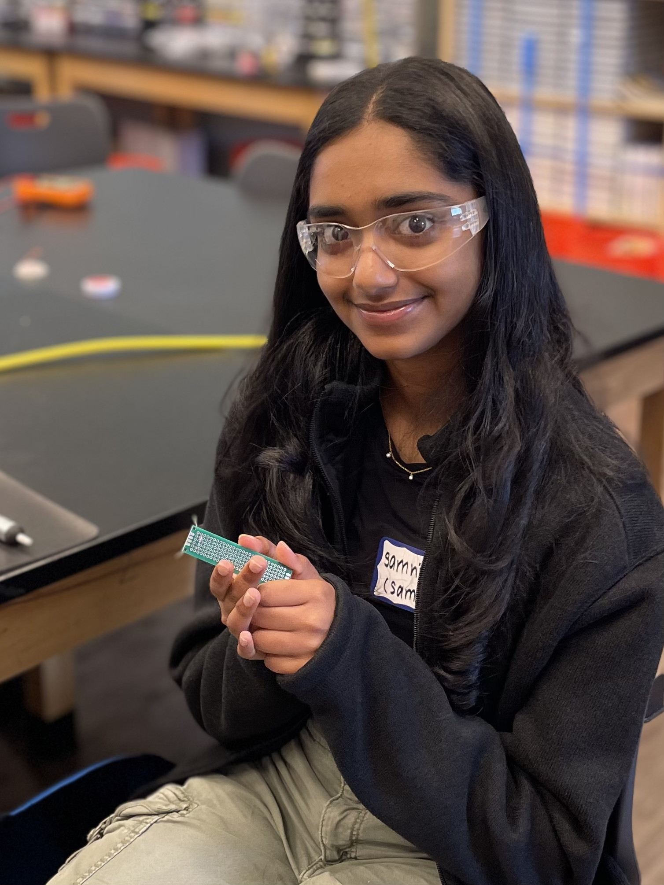
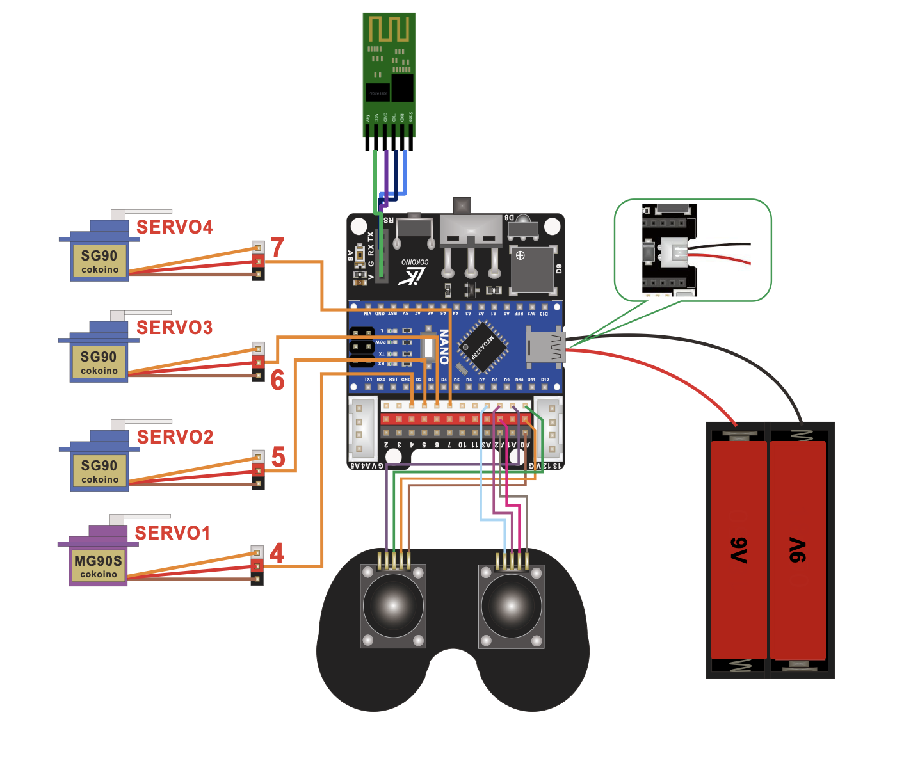
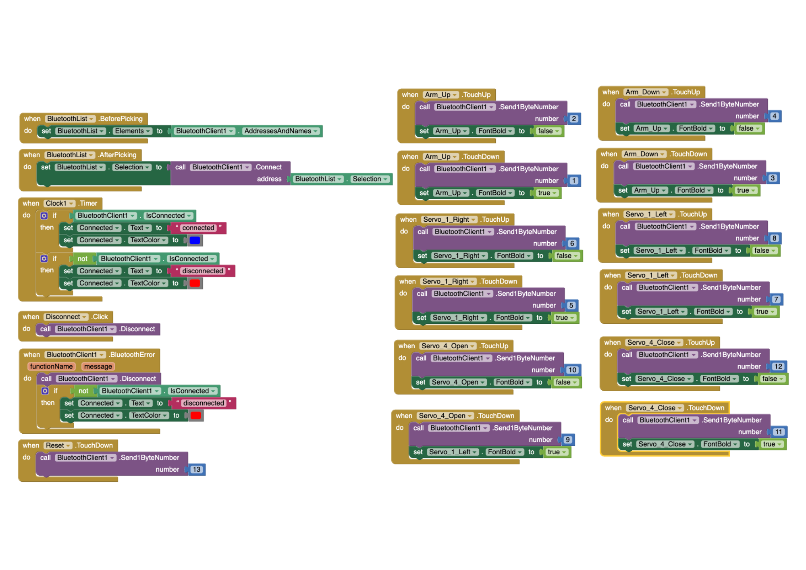

# Phone-Controlled Robotic Arm
This robotic arm has the ability to flex and grab objects around it using the help of the servos at each of its joints. You can control the arm in two ways: the 2-joystick controller or on an app on your phone. While the installation and software process encountered some bumps along the road, I am still very proud of the overall end product and its functionality!

<!---You should comment out all portions of your portfolio that you have not completed yet, as well as any instructions:--->
<!--- This is an HTML comment in Markdown --> 
<!--- Anything between these symbols will not render on the published site -->

| **Engineer** | **School** | **Area of Interest** | **Grade** |
|:--:|:--:|:--:|:--:|
| Samhita V | Mountain View High School | CS/AI | Incoming Junior

<!--- **Replace the BlueStamp logo below with an image of yourself and your completed project. Follow the guide [here](https://tomcam.github.io/least-github-pages/adding-images-github-pages-site.html) if you need help.** --->


  
# Final Milestone

<!---**Don't forget to replace the text below with the embedding for your milestone video. Go to Youtube, click Share -> Embed, and copy and paste the code to replace what's below.**-->

<iframe width="560" height="315" src="https://www.youtube.com/embed/tDY5gV5Dqng?si=A2Im4wSLJ2qfaZ2f" title="YouTube video player" frameborder="0" allow="accelerometer; autoplay; clipboard-write; encrypted-media; gyroscope; picture-in-picture; web-share" referrerpolicy="strict-origin-when-cross-origin" allowfullscreen></iframe>

## Description
This Android app  for the robotic arm consists of a two-way button interface that controls 3 points of movement on the arm (the base, the joints, and the claw) and also has a reset button that reconfigures all servos to its base rotation point of 90 degrees. On the MIT App Interface, I was able to set and configure different buttons to control and maintain points of movement on the arm to make it more user friendly. For the block code, I made it so that when a button is pressed for a certain servo movement type, a number is returned. In the Arduino code, I made sure to configure the precise movements of the servos based on whatever number was outputted so that the Arduino could understand how to move the servo based on outputs from the phone. The bluetooth module facilitates this connection between the phone and the Arduino and allows for the code to be read from both ends. 

## Challenges
There were many challenges during this process. I created and tested 4 different app interfaces with 4 different types of code before I was able to settle on something that was compatible with the arm. For example, one of my earlier interfaces used sliders instead of buttons, however, using the sliders was relatively harder for the arm to read and wasn’t able to precisely control the movements therefore wasting power in the process. Because of this, the app would freeze up, shut down, or cause the bluetooth module to disconnect frequently causing multiple errors. To solve this, I switched to using buttons in the new interface, as well as combining the points of movement from 4 to 3 to make it simpler to move. I also switched out the batteries since the earlier interfaces were draining its voltage. Eventually, I was able to get the app working and now it pairs smoothly with the robotic arm.

## Next Steps
My next steps are to research and start working on my modifications.


# Second Milestone

<!---**Don't forget to replace the text below with the embedding for your milestone video. Go to Youtube, click Share -> Embed, and copy and paste the code to replace what's below.**-->

<iframe width="560" height="315" src="https://www.youtube.com/embed/-cU3qCOhc94?si=2KmhIF64Ce1ipdxn" title="YouTube video player" frameborder="0" allow="accelerometer; autoplay; clipboard-write; encrypted-media; gyroscope; picture-in-picture; web-share" referrerpolicy="strict-origin-when-cross-origin" allowfullscreen></iframe>

## Description
For my main project, my second milestone was to program the joystick controller to be compatible with my robotic arm. Using code functions from the Servo library, the controller is able to manipulate the movement of the servos positions and set it to a specific rotation point based on how much the joystick is pushed forward/backwards. The servo wires that are connected to the Arduino help the computer read which servo should be moved according to which joystick is moved. The battery ensures that enough voltage is moving through the entire circuit so the robotic arm has enough energy to move freely without having jittery movements. 

## Challenges
There were a significant amount of challenges during this process, including issues in the electrical, mechnical, software, and power areas. When the provided code was uploaded, the robotic arm would go haywire and move entirely on its own without any prompting from the controller. We hoped that this meant it was a software issue, and rewrote the code from scratch to have a simpler way to control the arm. However, when that wasn't enough, we tried to isolate the movement of each individual servo to check if there were any faulty or broken ones that were attached. We found that servo 2 was broken, and replaced it with another servo, yet that one was also considerably weak and could not support the weight of the upper arm, and ended up replacing it a second time before it finally worked. There were also issues with loose jumper wires, which meant replacing and reiterating the wiring for both the servos and the joycon. There was also issues with the battery pack, due to it being plugged in for extensive periods of time, the voltage considerably lowered and became very weak, which meant replacing the batteries as well and being mindul of how long it is being used. While there were issues in each of these categories, eventually I was able to power through these challenges and create a working controller for my robotic arm. 

## Next Steps
My next steps are to code the app which will also be able to control the robotic arm.


# First Milestone

<!--**Don't forget to replace the text below with the embedding for your milestone video. Go to Youtube, click Share -> Embed, and copy and paste the code to replace what's below.** -->

<iframe width="560" height="315" src="https://www.youtube.com/embed/HHfXIwpPmhg?si=Wacx0CLeuHc3H47H" title="YouTube video player" frameborder="0" allow="accelerometer; autoplay; clipboard-write; encrypted-media; gyroscope; picture-in-picture; web-share" referrerpolicy="strict-origin-when-cross-origin" allowfullscreen></iframe>

## Description
For my main project, my first milestone was to assemble and build the components of my robotic arm, which includes the structure of the arm itself and the 2-joystick controller. I chose this project primarily because of its significance and symbolism of the many advancements in the robotics field and its usefulness in medical areas. These inventions have been influential to so many people and I wanted to experience what it would be like to create a simpler version of a prosthetic arm. This project is also the perfect difficulty level as it is not too hard but enough to challenge me in the right areas and expand my skill set. There are three main components to this project: the battery pack, the Arduino Nano board, and the structure of the arm itself. The battery pack is used to power the arm since it cannot function from the power provided by the computer alone. The Arduino Nano board is what facilitates communication between the computer and the arm + controller, which is how the arm is able to read code and able to move specific joints based on commands from the controller. The robotic arm has 4 main points of movement: the turning table on the bottom, the two joints on the arm, and the opening/closing of the claw at the top. 

## Challenges
Some challenges I had was finding and alternate design solution for my battery pack, since it was much wider than the one initally provided so I would not be able to screw it in the traditional way. Instead, we decided to use velcro tape to stick the battery pack onto the edge of the base plate. Another challenge I faced was installing the servo bracket onto the MG90 servo, since I made the mistake of installing it last which caused problems due to the limited space for my screwdriver to secure the bracket in place. However, after much struggle, I was able to fix it in place and it is able to work and function smoothly. 

## Next Steps
My next steps from here are to code the controller to be able to move certain joints depending on the movement and direction of the individual joystick.
 

# Schematics 
<!---Here's where you'll put images of your schematics. [Tinkercad](https://www.tinkercad.com/blog/official-guide-to-tinkercad-circuits) and [Fritzing](https://fritzing.org/learning/) are both great resoruces to create professional schematic diagrams, though BSE recommends Tinkercad becuase it can be done easily and for free in the browser. --->

Schematics drawn by Cokoino (github link: https://github.com/Cokoino/CKK0006)
Figure # Servo/Joycon Wiring Diagram



# Joycon Code
<!---Here's where you'll put your code. The syntax below places it into a block of code. Follow the guide [here]([url](https://www.markdownguide.org/extended-syntax/)) to learn how to customize it to your project needs. -->

```c++
#include <Servo.h>

Servo servo1;
Servo servo2;
Servo servo3;
Servo servo4;

int servoAng1, servoAng2, servoAng3, servoAng4;

void setup () {
  Serial.begin(9600);
  servo1.attach(5);  //Set the servo control pin as D4
  servo2.attach(6);  //Set the servo control pin as D5
  servo3.attach(7);  //Set the servo control pin as D6
  servo4.attach(10);  //Set the servo control pin as D7
}

int data_processing(int x) {
  if (x < 0) {
    x = 0;
  } 
  if (x > 180) {
    x = 180;
  }

  return x;
}

int joystick (int reading) {
  reading = (reading / 100) - 5;

  if (reading > -2 && reading < 0) {
    reading = 0;
  }

  return reading;
}

void loop () {
  int xL = joystick(analogRead(A0));
  int yL = joystick(analogRead(A1));
  int xR = joystick(analogRead(A2));
  int yR = joystick(analogRead(A3));


  servoAng1 += xL;
  servoAng2 += yL;
  servoAng3 += xR;
  servoAng4 += yR;

  servo1.write(servoAng1);
  servo2.write(servoAng2);
  servo3.write(servoAng3);
  servo4.write(servoAng4);

  servoAng1 = data_processing(servoAng1);
  Serial.println(servo1.read());
  servoAng2 = data_processing(servoAng2);
  Serial.println(servo2.read()); 
  servoAng3 = data_processing(servoAng3);
  Serial.println(servo3.read());
  servoAng4 = data_processing(servoAng4);
  Serial.println(servo4.read());

  delay(50);
}
```

# App Block Code


# App Arduino Code
```c++
#include "CokoinoArm.h"
#include <SoftwareSerial.h>
#define buzzerPin 9
int state=0;
CokoinoArm arm;
int xL,yL,xR,yR;
SoftwareSerial BTSerial(3,2);
const int act_max=10;    //Default 10 action,4 the Angle of servo
int act[act_max][4];    //Only can change the number of action
int num=0,num_do=0;
void turnUD(void){
  if(xL!=512){
    if(0<=xL && xL<=100){arm.up(10);return;}
    if(900<xL && xL<=1024){arm.down(10);return;} 
    if(100<xL && xL<=200){arm.up(20);return;}
    if(800<xL && xL<=900){arm.down(20);return;}
    if(200<xL && xL<=300){arm.up(25);return;}
    if(700<xL && xL<=800){arm.down(25);return;}
    if(300<xL && xL<=400){arm.up(30);return;}
    if(600<xL && xL<=700){arm.down(30);return;}
    if(400<xL && xL<=480){arm.up(35);return;}
    if(540<xL && xL<=600){arm.down(35);return;} 
    }
}
void turnLR(void){
  if(yL!=512){
    if(0<=yL && yL<=100){arm.right(0);return;}
    if(900<yL && yL<=1024){arm.left(0);return;}  
    if(100<yL && yL<=200){arm.right(5);return;}
    if(800<yL && yL<=900){arm.left(5);return;}
    if(200<yL && yL<=300){arm.right(10);return;}
    if(700<yL && yL<=800){arm.left(10);return;}
    if(300<yL && yL<=400){arm.right(15);return;}
    if(600<yL && yL<=700){arm.left(15);return;}
    if(400<yL && yL<=480){arm.right(20);return;}
    if(540<yL && yL<=600){arm.left(20);return;}
  }
}
void turnCO(void){
  if(arm.servo4.read()>7){
    if(0<=xR && xR<=100){arm.close(0);return;}
    if(900<xR && xR<=1024){arm.open(0);return;} 
    if(100<xR && xR<=200){arm.close(5);return;}
    if(800<xR && xR<=900){arm.open(5);return;}
    if(200<xR && xR<=300){arm.close(10);return;}
    if(700<xR && xR<=800){arm.open(10);return;}
    if(300<xR && xR<=400){arm.close(15);return;}
    if(600<xR && xR<=700){arm.open(15);return;}
    if(400<xR && xR<=480){arm.close(20);return;}
    if(540<xR && xR<=600){arm.open(20);return;} 
    }
  else{arm.servo4.write(8);

  }  
}
void date_processing(int *x,int *y){
  if(abs(512-*x)>abs(512-*y))
    {*y = 512;}
  else
    {*x = 512;}
}
void buzzer(int H,int L){
  while(yR<420){
    digitalWrite(buzzerPin,HIGH);
    delayMicroseconds(H);
    digitalWrite(buzzerPin,LOW);
    delayMicroseconds(L);
    yR = arm.JoyStickR.read_y();
    }
  while(yR>600){
    digitalWrite(buzzerPin,HIGH);
    delayMicroseconds(H);
    digitalWrite(buzzerPin,LOW);
    delayMicroseconds(L);
    yR = arm.JoyStickR.read_y();
    }
}
void C_action(void){
  if(yR>800){
    int *p;
    p=arm.captureAction();
    for(char i=0;i<4;i++){
    act[num][i]=*p;
    p=p+1;     
    }
    num++;
    num_do=num;
    if(num>=act_max){
      num=0;
      buzzer(600,400);
      }
    while(yR>600){yR = arm.JoyStickR.read_y();}
    //Serial.println(act[0][0]);
  }
}
void Do_action(void){
  if(yR<220){
    buzzer(200,300);
    for(int i=0;i<num_do;i++){
      arm.do_action(act[i],15);
      }
    num=0;
    while(yR<420){yR = arm.JoyStickR.read_y();}
    for(int i=0;i<2000;i++){
      digitalWrite(buzzerPin,HIGH);
      delayMicroseconds(200);
      digitalWrite(buzzerPin,LOW);
      delayMicroseconds(300);        
    }
  }
}
void setup() {
  Serial.begin(9600);
  BTSerial.begin(9600);
  //arm of servo motor connection pins
  arm.ServoAttach(5,11,7,10);
  //arm of joy stick connection pins : xL,yL,xR,yR
  arm.JoyStickAttach(A0,A1,A2,A3);
  pinMode(buzzerPin,OUTPUT);
  arm.servo1.write(90);
  arm.servo2.write(90);
  arm.servo3.write(90);
  arm.servo4.write(90);
}

void loop() {
  if(BTSerial.available()>0){
    state=BTSerial.read();
  }
  if(state==1){
    arm.down(20);//moves arm up just says down
  }
  if(state==3){
    arm.up(20);//moves arm down just says up
  }
  if(state==5){
    arm.left(20);
  }
  if(state==7){
    arm.right(20);
  }
  if(state==9){
    arm.open(20);
  }
  if(state==11){
    arm.close(20);
  }
  if(state==13){
    arm.servo1.write(90);
    arm.servo2.write(90);
    arm.servo3.write(90);
    arm.servo4.write(90);
  }
  if(arm.servo4.read()<7){
    arm.servo4.write(8);
  }
  Serial.println(state);
  xL = arm.JoyStickL.read_x();
  yL = arm.JoyStickL.read_y();
  xR = arm.JoyStickR.read_x();
  yR = arm.JoyStickR.read_y();
  date_processing(&xL,&yL);
  date_processing(&xR,&yR);
  turnUD();
  turnLR();
  turnCO();
  C_action();
  Do_action();
}
```

# Bill of Materials
<!---Here's where you'll list the parts in your project. To add more rows, just copy and paste the example rows below.
Don't forget to place the link of where to buy each component inside the quotation marks in the corresponding row after href =. Follow the guide [here]([url](https://www.markdownguide.org/extended-syntax/)) to learn how to customize this to your project needs. --->

| **Part** | **Note** | **Price** | **Link** |
|:--:|:--:|:--:|:--:|
| Arduino Nano | Managing and controlling the robot’s components | $24.90 | <a href="https://www.amazon.com/Arduino-A000066-ARDUINO-UNO-R3/dp/B008GRTSV6/"> Link </a> |
| Bluetooth Module | Sending and processing signals between the app and the Arduinor | $7.99 | <a href="https://www.amazon.com/Arduino-A000066-ARDUINO-UNO-R3/dp/B008GRTSV6/"> Link </a> |
| SG90 Servos | Moving the joints and wooden components | $16.95 | <a href="https://www.amazon.com/American-Robotic-Supply-Authentic-Digital/dp/B0783NS32R/ref=sr_1_4?keywords=tower+pro+sg90&qid=1689780732&sr=8-4"> Link </a> |
| MG90 Servo | Moving the base | $10.99 | <a href="https://www.amazon.com/MG90S-Servo-Motor-Helicopter-Arduino/dp/B07L6FZVT1?th=1"> Link </a> |
| Batteries | Powering the Arduino and Bluetooth Module | $6.58 | <a href="https://www.amazon.com/Energizer-Alkaline-General-Purpose-Battery/dp/B00003IE4E?th=1"> Link </a> |
| JST Battery Connectors | Connect the batteries to the circuit’s battery pin | $8.99 | <a href="https://www.amazon.com/daier-Micro-2-Pin-Connector-Female/dp/B01DUC1O68"> Link </a> |
| Battery Clips | Hold the batteries to flow its current into the JST connectors | $5.99 | <a href="https://www.amazon.com/Battery-Connector-I-Type-Plastic-Housing/dp/B07TRKYZCH"> Link </a> |
| Female to Female Connectors | Connecting the Arduino to the wired controller | $6.98 | <a href="https://www.amazon.com/EDGELEC-Breadboard-1pin-1pin-Connector-Multicolored/dp/B07GD312VG/ref=sr_1_4?crid=11X4PIA5EMMZO&keywords=female%2Bto%2Bfemale%2Bconnectors&qid=1689781475&s=industrial&sprefix=female%2Bto%2Bfemale%2Bconnector%2Cindustrial%2C150&sr=1-4&th=1"> Link </a> |
| Joysticks | Allow the user to control the robot using a controller | $9.95 | <a href="https://tinkersphere.com/buttons-switches/922-joystick-breakout-module-arduino-raspberry-pi-compatible.html"> Link </a> |

# Starter Milestone

<!--- **Don't forget to replace the text below with the embedding for your milestone video. Go to Youtube, click Share -> Embed, and copy and paste the code to replace what's below.** --->

<iframe width="560" height="315" src="https://www.youtube.com/embed/Awwvdmpums8?si=MY5cCiRKkaQ0KKCn" title="YouTube video player" frameborder="0" allow="accelerometer; autoplay; clipboard-write; encrypted-media; gyroscope; picture-in-picture; web-share" referrerpolicy="strict-origin-when-cross-origin" allowfullscreen></iframe>

For my starter project, I chose the BlueStamp Arduino Starter. I have had prior experiences with Arduinos in CS classes I have taken at school, but those have been very software heavy, rather than mechanical or electrical heavy. By choosing this starter, I hoped to gain more knowledge on circuits and Arduinos as a whole since my final project uses them as well, and it would be productive to get familiar with how to build and manage Arduino boards. The board has an input, the button, and an output, the LED. When the button is pressed, a message (taken from the code) is transferred throughout the jumper wires and to the Arduino, which is then passed on to the LED which tells it to turn on, until the button is released which severs the connection. The voltage transmission is regulated and controlled by the resistor which is able to  limit the voltage being passed throughout the circuit so it is not too little or too much. 

## Challenges
Some challenges I faced was mounting the proto-sheild onto the Arduino board since the intructions were a bit complicated, and having to solder the two boards together was also a challenge due to the limited space and my limited skill set with soldering. There were also some struggles with the circuit connection between the button and LED. However, after going through each step carefully and thoroughly, I was able to pinpoint the exact problem and where it was coming from, and then able to solve any issues I had. 

## Next Steps
Now that this project is completed, and I have a better understanding of Arduino boards and circuits, I can now start on my final project!

<!--- # Other Resources/Examples
One of the best parts about Github is that you can view how other people set up their own work. Here are some past BSE portfolios that are awesome examples. You can view how they set up their portfolio, and you can view their index.md files to understand how they implemented different portfolio components.
- [Example 1](https://trashytuber.github.io/YimingJiaBlueStamp/)
- [Example 2](https://sviatil0.github.io/Sviatoslav_BSE/)
- [Example 3](https://arneshkumar.github.io/arneshbluestamp/)

To watch the BSE tutorial on how to create a portfolio, click here.
--->
